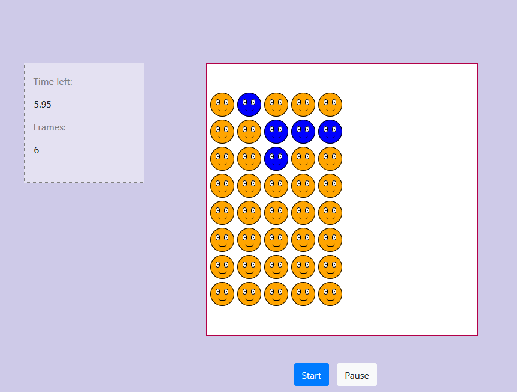

# :smiley: Color tap game
*Welcome!* <br/><br/>


   *The goal of the game is to reach much more frames with smileys colored in the same color. <br/>
   Frames will content smileys colored in two different colors. You can change color of each smiley by clicking on him. 
   You have to change color of smileys until they aren't in the same color. <br/>
   Specially, if all smileys are already in the same color or you have just one smiley in the frame, you have only to click two times on      any smiley in the frame to continue. These lucky cases are easy points. :blush: <br/>*
   
   **⚠️ Pay attention to the time limit!** <br/><br/>
   
   You can get this game just with cloning this repository. Position (by terminal) in directory where you want to store this game
   and type command below:
   ```
      $ git clone "https://github.com/kate-97/JavaScript-Course--Levi9"
   ```
   Open file named by "color_tap.html"  (this file is in **src** directory) in some browser (*GoogleChrome*, *Firefox*, ...) and you are ready. <br/><br/>
   
   :relaxed: :relaxed: :relaxed: :relaxed: :relaxed: ***Enjoy playing!*** :relaxed: :relaxed: :relaxed: :relaxed: :relaxed: 
